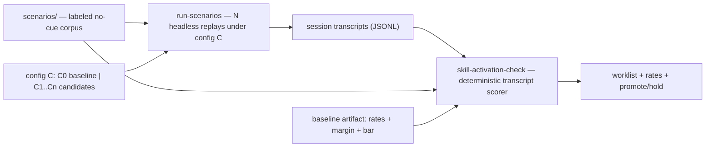

# 0001-self-initiated-skill-activation — DESIGN

## Architecture

The deployment is a **measurement instrument**, not a chosen activation mechanism: the mechanism is a pluggable slot the harness selects by measured lift (Decision-1). Everything wears the framework's stdlib-Python, root-executable idiom; the scorer is a direct `health-check` analogue (read-only, model-free, worklist-to-stdout, exit-code-as-verdict).

Caption: the corpus runs through the agent under each configuration — baseline `C0`, then each candidate mechanism — `N` trials per scenario; the scorer reads the resulting transcripts plus the recorded baseline and emits a per-scenario miss / false-fire worklist and a promote-or-hold verdict. The mechanism under test enters only as the driver's config input (Decision-1); it is never wired into the scorer.

## Decision-1: eval-gated-mechanism-slot
The activation mechanism is a pluggable configuration selected by measured lift through the harness, never pre-chosen; candidates are enumerated but none is adopted until it clears the gate (Decision-5). See rationale at [design-rationale.md#Decision-1-eval-gated-mechanism-slot].
- **Slot.** A named config the driver applies before running the corpus. Baseline `C0` = current state, no change. `29c45d0`'s trigger-first reordering touched only the KB-wiring skills; the **scoped** skills `handoff` / `compact-focus` were outside it and stay **capability-first**, so for what this eval measures `C0` is the capability-first state (`UNDERSTANDING#Delta-3-scoped-skills-stay-capability-first`).
- **Initial candidate matrix (test inputs, not choices):** `C1` a standing skill-consultation checkpoint in the shared operating frame; `C2` a reflection/self-check pass over the just-finished turn; `C3` per-skill description variants — the **trigger-first** form as the contrast against the capability-first `C0` scoped skills, so the matrix adjudicates the trigger-first ordering theory for the scoped skills (and by extension whether `29c45d0` earned its keep) (`UNDERSTANDING#Delta-3-scoped-skills-stay-capability-first`); `C4` (control ceiling) the deterministic keyword reminder on the keyword-*present* subset — a reference ceiling, not a no-cue solution.
- **Realizes SPEC#O-1-skill-fires-on-cueless-match contingently:** O-1 holds iff some candidate clears Decision-5. If none does, the deliverable is the instrument + baseline + a negative verdict — an honest non-result, per the REQUIREMENT "Solving by plausibility" Non-goal.

## Decision-2: out-of-band-transcript-scorer
`skill-activation-check` scores "did the scoped skill fire" by reading persisted session transcripts post-hoc — model-free, read-only, deterministic — keyed on the `Skill` tool-use and the `attributionSkill` record field; no live hook. See rationale at [design-rationale.md#Decision-2-out-of-band-transcript-scorer].
- **Detection.** Within a scenario's turn(s), the scoped skill fired iff a content block `{"type":"tool_use","name":"Skill","input":{"skill":"<scoped>"}}` appears, OR a record carries top-level `attributionSkill == "<scoped>"`. Dual-keyed for robustness. Scoped skills `compact-focus`, `handoff` come from one single-sourced list (engine `sources.py` single-sourcing idiom). Transcript schema evidence: research.md#claude-code-transcript-observability.
- **Transcript locations.** Main `~/.claude/projects/<cwd-slug>/<session-uuid>.jsonl`; sub-agent runs under `<session-uuid>/subagents/agent-<id>.jsonl` — the scorer walks the `subagents/` subdir.
- **Output (health-check idiom).** stdout worklist, one line per scored scenario that missed or false-fired: `<scenario-id>: [miss <skill>] | [false-fire <skill>]`; silence = correct. stderr summary: `scored N scenarios — self-use R1, false-fire R2`. Exit `0` normal / `2` usage error; clean error, no traceback. Realizes SPEC#O-2-passed-over-moment-observable.

## Decision-3: labeled-no-cue-corpus
The corpus is declarative data — a `scenarios/` set of no-cue scenarios, matching and non-matching, each labeled `should_fire` — built by the dimensions → seeds → synthetic recipe, with the real compact-focus failure as seed #1. See rationale at [design-rationale.md#Decision-3-labeled-no-cue-corpus].
- **Schema (stdlib JSON; not YAML-for-data, per repo idiom):** `{ "id", "skill": "compact-focus|handoff", "setup": "<analyst-facing description of the triggering condition + framing>", "prompt": "<the verbatim first-person no-cue user turn the driver injects>", "framing": "deliberation|imperative|tangential|unrelated", "should_fire": true|false, "reproducible": true|false }`. `setup` is for human review; `prompt` is what the agent actually receives (a description fed as a prompt makes the agent reason *about* the scenario rather than *be in* it — `UNDERSTANDING#Delta-2-corpus-setups-are-not-replayable-turns`). `reproducible` marks whether a single headless turn (with minimal priming) can establish the condition; stateful conditions that cannot are `false` and the driver drops them.
- **Dimensions:** scoped-skill × framing × should_fire; ~20 hand-written seeds set the distribution, scaled synthetically, then filtered. Matching *and* non-matching scenarios both required (false-fire needs negatives).
- **Realizes SPEC#INV-3-scope-and-measurement-binding.** Lives at repo root `scenarios/` with its own `README.md` (per-dir-README convention).

## Decision-4: replayed-headless-driver
`run-scenarios` runs the corpus through the agent under a given config, `N` independent trials per scenario, capturing the transcripts the scorer reads. See rationale at [design-rationale.md#Decision-4-replayed-headless-driver].
- **N trials realize the "sustains across runs" clause of SPEC#INV-1-self-use-rate-beats-baseline:** self-activation is non-deterministic, so per-scenario firing is aggregated over `k` trials (pass^k-style), never read from a single run.
- **Realization.** A thin wrapper over headless `claude` (non-interactive print mode), injecting each scenario's verbatim `prompt` (the first-person no-cue turn), priming minimal context where feasible; it records the transcript paths it produced for the scorer. Injecting `prompt` not `setup` is load-bearing: a third-person description makes the agent reason *about* the scenario instead of *being in* it (`UNDERSTANDING#Delta-2-corpus-setups-are-not-replayable-turns`).
- **Reproducibility boundary.** Some triggers — e.g. compact-focus's "context is heavy" — are stateful and cannot be recreated by a single headless turn the way an explicit turn can. The boundary is the per-scenario `reproducible` marker (`DESIGN#Decision-3-labeled-no-cue-corpus`): the driver drops every `reproducible:false` scenario and logs it, never fakes a green result; the dropped set is surfaced, not hidden. If the dropped set is large, the headless baseline under-covers the stateful triggers and that coverage gap must be stated as a known limitation.

## Decision-5: promotion-gate
A candidate promotes iff, over the corpus with `N` trials, self-use rate ≥ baseline + margin AND false-fire rate ≤ bar; otherwise it is held. WHY: composes SPEC#INV-1-self-use-rate-beats-baseline and SPEC#INV-2-false-fire-rate-bounded into one gate. The `margin` and `bar` are product-decision parameters fixed with the baseline and read from the baseline artifact — pass-rate is a product decision, not a fixed number (eval-driven-development).
- **Baseline artifact (written by `skill-activation-check --record-baseline` on `C0`, read on every scoring run):** `{ "self_use_rate", "false_fire_rate", "margin", "false_fire_bar", "n_trials", "recorded_at" }`.
