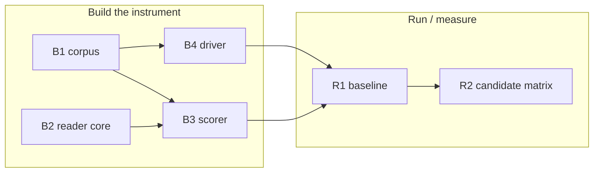

# 0001-self-initiated-skill-activation — TASK

## Guidelines

- **Repo idiom.** Every new executable is stdlib-Python3 at repo root with a paired `<tool>-selftest`; every new dir carries a `README.md`; the scoped-skill list is single-sourced, never re-listed — match the `health-check` family (research.md#framework-tool-and-selftest-idiom).
- **Branch + attribution.** Work on a feature branch in the metacognition repo off its main; commits there are mynghn-attributed (the framework repo's owner) — don't commit under the active account.
- **Grounding stance.** A candidate mechanism is promoted *only* through R2's gate. A negative verdict (no candidate clears) is a valid deliverable — never something to fix by loosening the gate or by a "looks better" judgment.

## Dependency DAG

Caption: the **Build** track produces the measurement instrument (a labeled corpus, a firing-detection core, the scorer, the driver); the **Run** track exercises it — capture a baseline, then run the candidate matrix to a verdict.

## Task: B1

- **Goal**: Stand up the labeled no-cue scenario corpus that binds every later measurement to the scoped skills (`SPEC#INV-3-scope-and-measurement-binding`) — sourced error-analysis-first from real session traces, then scaled dimensions→seeds→synthetic with matching *and* non-matching cases per `DESIGN#Decision-3-labeled-no-cue-corpus` (the real compact-focus failure is seed #1).
- **Repo**: metacognition — `scenarios/` (+ `scenarios/README.md`)
- **Completion**:
  - Every scenario parses against the `DESIGN#Decision-3-labeled-no-cue-corpus` schema and carries `skill` / `setup` / `prompt` / `framing` / `should_fire` / `reproducible` (one-shot schema check).
  - Each `prompt` is a verbatim first-person no-cue user turn (no skill named, no trigger command) the driver can inject — not a third-person description (`UNDERSTANDING#Delta-2-corpus-setups-are-not-replayable-turns`); each scenario is marked `reproducible` per whether a single headless turn can establish its condition.
  - Both matching and non-matching scenarios exist for each scoped skill, so false-fire is measurable (`SPEC#INV-2-false-fire-rate-bounded` becomes exercisable).
  - The ~20 seed set is hand-reviewed; trace review stops when ~20 fresh traces surface no new failure category.
- **Dependencies**: none

## Task: B2

- **Goal**: Make "did a scoped skill fire in this run" a deterministic, reusable read (`DESIGN#Decision-2-out-of-band-transcript-scorer`) — a shared engine module detecting firing from session JSONL, dual-keyed on the `Skill` tool-use and `attributionSkill` and walking sub-agent transcripts, single-sourced so scorer and tests can't drift.
- **Repo**: metacognition — `engine/` module
- **Completion**:
  - A selftest feeds fixture JSONL — a firing, a non-firing, and a sub-agent firing — and asserts correct detection in each case (tmpdir fixtures, `<tool>-selftest` idiom).
  - On an unrecognized transcript shape the reader fails loudly rather than reporting "no fire" (the `DESIGN#Decision-2-out-of-band-transcript-scorer` invalidation cue).
- **Dependencies**: none

## Task: B3

- **Goal**: Deliver `skill-activation-check`, the scorer that turns transcripts into a verdict — it records misses as a reviewable worklist (`SPEC#O-2-passed-over-moment-observable`) and applies the lift+precision gate (`SPEC#INV-1-self-use-rate-beats-baseline`, `SPEC#INV-2-false-fire-rate-bounded`) per `DESIGN#Decision-2-out-of-band-transcript-scorer` and `DESIGN#Decision-5-promotion-gate`, including the `--record-baseline` mode.
- **Repo**: metacognition — root `skill-activation-check` + `skill-activation-check-selftest`
- **Completion**:
  - Selftest drives the real tool over a fixture corpus + fixture transcripts + a fixture baseline and asserts: (a) per-scenario miss/false-fire worklist lines; (b) the computed self-use and false-fire rates; (c) the promote/hold verdict at the gate; (d) the `--record-baseline` artifact shape.
  - Clean error (rc 2, no traceback) on malformed input; silent stdout on an all-correct run.
- **Dependencies**: B1 lands the corpus schema the scorer reads; B2 lands the firing-detection core it calls.

## Task: B4

- **Goal**: Deliver `run-scenarios`, the driver that produces the evidence — it replays each scenario through the agent under a named config `N` independent trials so a verdict rests on sustained behavior, not one lucky run (the "sustains across runs" clause of `SPEC#INV-1-self-use-rate-beats-baseline`), per `DESIGN#Decision-4-replayed-headless-driver`.
- **Repo**: metacognition — root `run-scenarios` + `run-scenarios-selftest`
- **Completion**:
  - Selftest exercises the driver in a fixture/dry-run mode (no live agent call) and asserts it injects each scenario's `prompt` and emits the correct per-(scenario, trial) transcript-path manifest for a given `--config` and `N`.
  - A `reproducible:false` fixture scenario is dropped and logged, not faked (`DESIGN#Decision-4-replayed-headless-driver` reproducibility boundary; the marker comes from `DESIGN#Decision-3-labeled-no-cue-corpus`).
- **Dependencies**: B1 lands the corpus the driver replays.

## Task: R1

- **Goal**: Establish the baseline — the first real measurement that makes the gap countable (`SPEC#INV-3-scope-and-measurement-binding`'s "baseline recorded before any change") — by running the corpus through config `C0` (`DESIGN#Decision-1-eval-gated-mechanism-slot`, now reflecting main's trigger-first wiring — `UNDERSTANDING#Delta-1-baseline-now-ships-trigger-first-wiring`) and recording the rates plus the product-decision `margin`/`bar` into the baseline artifact (`DESIGN#Decision-5-promotion-gate`).
- **Repo**: metacognition — `scenarios/` baseline artifact
- **Completion**:
  - A baseline artifact exists with `self_use_rate`, `false_fire_rate`, `margin`, `false_fire_bar`, `n_trials` (one-shot observation).
  - The dropped (non-reproducible) scenario set is logged; baseline self-use is not ~100% (a too-easy corpus is flagged per `DESIGN#Decision-3-labeled-no-cue-corpus`); `margin`/`bar` are set from tolerable-failure economics, not vanity.
- **Dependencies**: B3 lands `--record-baseline`; B4 lands the driver that runs `C0`.

## Task: R2

- **Goal**: Run the candidate matrix and produce the project's verdict — promote a mechanism only if it clears the gate, making the skill fire on cueless moments (`SPEC#O-1-skill-fires-on-cueless-match`) within `SPEC#INV-1-self-use-rate-beats-baseline` and `SPEC#INV-2-false-fire-rate-bounded`, else deliver the negative result + baseline — per `DESIGN#Decision-1-eval-gated-mechanism-slot` and `DESIGN#Decision-5-promotion-gate`. Each candidate (checkpoint, reflection pass, description variants — incl. the capability-first contrast adjudicating the shipped `29c45d0` trigger-first wiring per `UNDERSTANDING#Delta-1-baseline-now-ships-trigger-first-wiring`, keyword control) is authored as a test input.
- **Repo**: metacognition — candidate configs + the verdict record
- **Completion**:
  - Each candidate has a scored result (self-use + false-fire vs baseline) and a gate verdict (`skill-activation-check` output per config).
  - If a candidate clears, it is promoted and re-scored to confirm the lift sustains (`SPEC#INV-1-self-use-rate-beats-baseline`); if none clears, the verdict records the negative result against the baseline (the REQUIREMENT "Solving by plausibility" Non-goal — not a failure to patch by relaxing the gate).
- **Dependencies**: R1 lands the baseline every candidate is measured against.
