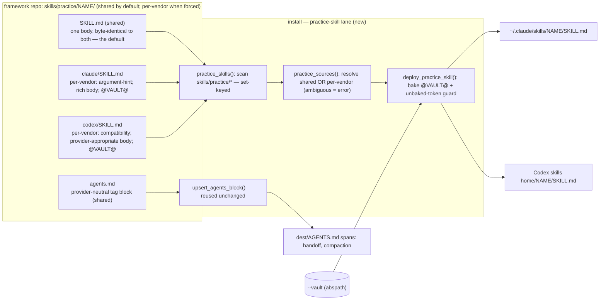

# 0002-ship-practice-skills — Design

## Architecture

A new **practice-skill lane** in `install`, parallel to `deploy_maintenance`. It reuses the maintenance lane's authored-skill-shipped-as-is + `@VAULT@`-baking, adds the activation that maintenance omits (the surgical `upsert_agents_block`, reused unchanged), and — unlike the hard-named maintenance constant — treats practice skills as a *set* discovered by scanning `skills/practice/*`. Each skill carries **one shared `SKILL.md` by default, or a per-vendor `SKILL.md` per provider only when a runtime primitive forces the bodies apart** (`Understanding#Delta-2-per-vendor-is-the-exception-shared-is-default`), plus **one provider-neutral** activation block. The lane resolves that layout, deploys the right body to each provider's skill dir, and upserts the shared `AGENTS.md` span; a golden divergence snapshot per per-vendor skill, checked by `install-selftest`, holds the split to its forced minimum. `generate` (sibling-only) is untouched. The Codex skills-home path stays the installer's existing one (see Non-goals).

## D-1: practice-skill-lane

Add a dedicated practice-skill lane to `install`, parallel to `deploy_maintenance`, that ships every authored skill under `skills/practice/<name>/` to both providers and emits its activation — keyed on the directory set, not a hard-named constant. Realizes `Spec#B-1-practice-skills-deployed-on-install`; its scoped, additive writes are half of `Spec#C-1-install-owns-only-its-regions` (the AGENTS.md half is `D-3`).

- **Source layout (shared-or-per-vendor)** — `skills/practice/<name>/` holds **either** one shared `SKILL.md` (deployed byte-identical to both providers — the default) **or** a per-vendor `<provider>/SKILL.md` per provider (`claude/` and `codex/` — the exception a skill earns only on a runtime-forced primitive; frontmatter per `D-5`, body per `D-6`; `Understanding#Delta-2-per-vendor-is-the-exception-shared-is-default`), with the `@VAULT@` token per `D-2` either way; plus `skills/practice/<name>/agents.md` (the single provider-neutral activation block per `D-3`). The two layouts are mutually exclusive — both present is a clean error. Initial set: `handoff`, `compact-focus` (both per-vendor).
- **Discovery** — `practice_skills()` lists subdirs of `skills/practice/` (each subdir = one skill), mirroring `siblings()` over `config/`. A later-added directory deploys with no code change — the set-keying `B-1` requires.
- **Deploy** — `deploy_practice_skill(dest, vault, name)`: `practice_sources()` resolves the layout (shared → the one file for every provider; per-vendor → each `<provider>/SKILL.md`; both present → `SystemExit`); then for each `provider in PROVIDERS`, bake tokens (`D-2`) and write the baked text to `<dest>/<provider>/skills/<name>/SKILL.md`; finally read the shared `agents.md` once and call `upsert_agents_block` (`D-3`). The provider→source-subdir map is `.claude`→`claude`, `.codex`→`codex`.
- **Divergence gate (per-vendor only)** — each per-vendor skill ships a golden `vendor-divergence` snapshot (content-not-position: the sorted set of provider-unique lines); `install-selftest` asserts the live divergence equals it — drift either way fails until intentionally re-snapshotted (`--update-divergence`) — and forbids a Claude-only primitive (`$ARGUMENTS`, `/compact <focus>`) in a Codex body. This holds the split to its forced minimum (`Understanding#Delta-2-per-vendor-is-the-exception-shared-is-default`, `Spec#C-3-deployed-skill-matches-its-runtime`); principle + gate are documented in `skills/practice/README.md`.
- **Additive, single-file** — overwrite `SKILL.md` in place, no prune. Practice skills are single-file (research), so maintenance's multi-file orphan-prune does not apply; a retired practice skill is a manual cutover, consistent with the repo's additive install (`install` docstring).
- **main() hook** — after `deploy_maintenance(dest, vault)`, gated the same way: a full run, or `--only <practice-name>`, deploys practice skills; a surgical `--only <sibling>` leaves them alone.

Rationale: `design-rationale.md#D-1-practice-skill-lane`.

## D-2: canonical-body-and-vault-generalization

The framework's canonical practice-skill bodies are the **rich, hand-tuned** ones, authored into `skills/practice/<name>/` (a shared `SKILL.md`, or a per-vendor `<provider>/SKILL.md` per `D-1`) with their one machine-specific element — the vault path — replaced by the existing `@VAULT@` token. Realizes `Spec#B-3-deployed-skill-resolves-to-adopter-vault` and `Spec#C-2-shipped-skills-carry-no-author-personal-content`. The Claude body is the rich base; provider divergence in the body is owned by `D-6`.

- **The only personal content** is one optional reference line per skill (research): `@VAULT@/context-engineering/knowledge/explore-execute-boundary.md` (handoff) and `@VAULT@/context-engineering/knowledge/compaction-vs-eviction.md` (compact-focus). Everything else is already generic.
- **Grounding rides in the KB, not a personal global block** — each body cites the context-engineering KB entry it loads (the `@VAULT@/…/knowledge/…` reference above) as the authority for its discipline. The shipped `compact-focus` previously deferred to "the `<compaction>` policy in the global instructions" — the adopter's own operating-frame block, author-personal content a clean adopter need not have; citing the KB entry instead keeps the deployed skill self-grounding and portable, reinforcing `Spec#C-2-shipped-skills-carry-no-author-personal-content` (`Understanding#Delta-2-per-vendor-is-the-exception-shared-is-default`).
- **Baking** reuses the maintenance mechanism: substitute `@VAULT@` → `os.path.abspath(os.path.expanduser(vault))` (the one normalized vault `install` already computes), then the **unbaked-token guard** `re.findall(r"@[A-Z_]+@", text)` → `SystemExit` on any leftover. Token set for a practice body is `{@VAULT@}` today.
- **Activation blocks need no baking** — they cite knowledge by slug (`knowledge/{explore-execute-boundary, …}`), not by path (research), so they carry no personal content.
- **C-2 source invariant** — every authored `SKILL.md` carries no literal `/Users/…` and no literal `metacognition-vault`, only the token; a source scan asserts this (a Tasks completion criterion, trivial — no Decision needed).

Rationale: `design-rationale.md#D-2-canonical-body-and-vault-generalization`.

## D-3: activation-via-surgical-upsert

Emit each practice skill's activation by passing its **complete, provider-neutral authored `<tag>…</tag>` block** straight to the existing `upsert_agents_block`, with the tag authored explicitly — `<handoff>` and `<compaction>` — not derived from the skill name. Realizes `Spec#B-2-activation-emitted-on-install`, the shared-file half of `Spec#C-1-install-owns-only-its-regions`, and the activation half of `Spec#C-3-deployed-skill-matches-its-runtime`.

- **Reused unchanged** — `upsert_agents_block(agents_path, block)` extracts the tag (`block[1:block.index(">")]`), full-line-matches `^<tag>$…^</tag>$`, replaces in place when present or appends at EOF, and writes only on change (`install:134-160`). That surgical, idempotent, byte-for-byte-preserving upsert *is* the C-1 realization: only the named span changes; the adopter's operating frame is untouched across re-runs.
- **One shared block, provider-neutral** — the activation lives in the single shared `AGENTS.md` both runtimes read, so the block names no single-runtime-only invocation as the only path (`C-3`): it says "the `handoff` skill emits …", not "On Claude, `/handoff` …". A second per-provider block is impossible here — the file is shared — so neutrality is required, not optional.
- **Activation triggers; the skill self-grounds** — the block's job is discovery (surface the skill at its moment), not doctrine. The deployed body grounds its discipline in the context-engineering KB entry it loads (`D-2`), not in this block or the adopter's `<compaction>`/`<handoff>` global-instructions prose, so a skill stays correct even where those operating-frame blocks differ or are absent (`Understanding#Delta-2-per-vendor-is-the-exception-shared-is-default`).
- **Source is the full block** — `skills/practice/<name>/agents.md` includes its own `<tag>` and `</tag>` (unlike a sibling's tag-less `wiring/<s>.agents.md`, which `agents_block()` wraps using the stem). The lane therefore **bypasses** `agents_block()` (sibling-only, name-derived tag) and feeds the authored block directly.
- **Explicit tags** — `compact-focus`'s moment-tag is `<compaction>` (≠ its name), and matching the adopter's existing `<handoff>`/`<compaction>` span names lets the upsert **take them over in place** rather than orphaning the old block and appending a duplicate.

Rationale: `design-rationale.md#D-3-activation-via-surgical-upsert`.

## D-4: byte-identical-frontmatter (retired)

Superseded by `D-5-per-provider-frontmatter` (see `Understanding#Delta-1-codex-needs-per-provider-not-byte-identical`). The original choice — one frontmatter byte-identical to both providers — assumed Codex tolerates Claude's frontmatter inertly and the two providers never diverge. Codex's own conventions (`compatibility`, `metadata.short-description`; no `argument-hint`/`$ARGUMENTS`) make per-provider frontmatter correct instead. Kept here, retired, so the considered-and-rejected byte-identical path stays reconstructable.

## D-5: per-provider-frontmatter

Ship **per-provider** frontmatter: the `claude/SKILL.md` carries `argument-hint` (where the skill has one); the `codex/SKILL.md` carries `compatibility: Designed for Codex` + `metadata.short-description`. Both share `name`; the `description` is shared too, except where `Spec#C-3-deployed-skill-matches-its-runtime` forces it to track per-provider delivery — e.g. `compact-focus`, whose Claude `description` names the `/compact <focus>` form the Codex copy must not claim. Supports `Spec#B-1-practice-skills-deployed-on-install` and `Spec#C-3-deployed-skill-matches-its-runtime`.

- This matches the conventions each runtime actually uses (the shapes the adopter's own chezmoi source already carried per provider; research).
- Consequence for `D-1`: the lane reads a per-provider source file rather than one shared `SKILL.md`; no runtime gets a foreign frontmatter key.

Rationale: `design-rationale.md#D-5-per-provider-frontmatter`.

## D-6: per-provider-body-divergence

Where a skill's body relies on a runtime-specific primitive, ship a **provider-appropriate body** per runtime. Realizes `Spec#C-3-deployed-skill-matches-its-runtime`.

- **`compact-focus` (the material divergence)** — Claude's body emits a `/compact <focus>` line to paste (Claude Code accepts a focus argument). Codex's `/compact` does **not** reliably take a focus argument; the documented Codex pattern is a normal pre-compaction *message* stating what to keep/drop, then plain `/compact` (research). So the Codex body produces that focus *message* (not a `/compact <focus>` command line) and directs the user to run `/compact` after — same working-set discipline, runtime-correct delivery.
- **`handoff` (minor divergence)** — the Claude body uses `$ARGUMENTS` (a Claude-Code substitution); the Codex body instead instructs inferring/confirming the goal from the request, carrying no `$ARGUMENTS` token.
- **Shared discipline** — both providers' bodies keep the same labeled-block structure and selection rules (`Carry`/`Negatives`/… for handoff; `Keep`/`Verbatim`/… for compact-focus); only the runtime-specific delivery differs. The bodies are authored per provider (`D-1` layout), not generated from a single source — acceptable duplication for a small curated set (rationale).

Rationale: `design-rationale.md#D-6-per-provider-body-divergence`.

## Non-goals

- **Codex skills-home migration to `~/.agents/skills/`.** Per current Codex docs the official user-skills home is `~/.agents/skills/`, not the `~/.codex/skills/` the installer targets for *every* skill today (via `PROVIDERS`). Correcting it is framework-wide — it also fixes knowledge-sibling and maintenance discovery on Codex — so it is deferred to its own issue. This feature deploys Codex practice skills via the installer's existing path; bounded by `Spec#` Non-goals.
