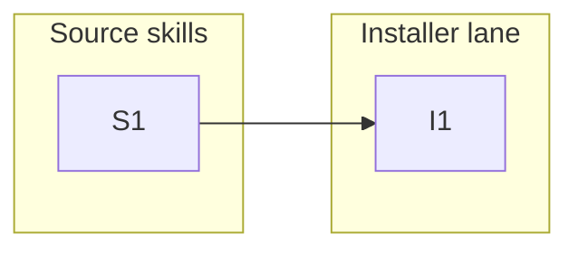

# 0002-ship-practice-skills — Tasks

## Guidelines

- **Sandbox every install/selftest run.** Invoke `install` (and `install-selftest`) against a sandbox `--dest`, plus a sandboxed `$XDG_CONFIG_HOME` and `--vault` — never the live `~` / `~/AGENTS.md`. The live shared `AGENTS.md` is still chezmoi-managed, so touching it risks a chezmoi/installer conflict (`install` module docstring; `wiring/README.md`).
- **Codex skills-home path is out of scope.** Deploy Codex skills via the installer's existing path; the migration to the official `~/.agents/skills/` is a separate framework-wide issue (`Design#` Non-goals, `Spec#` Non-goals).

## Dependency DAG

Two tracks: **S** authors the per-provider practice-skill source; **I** adds the installer lane that ships and activates it. S1 lands the source that makes the I1 lane deployable and its selftest exercisable.

## T: S1

- **Goal**: Bring `/handoff` and `/compact-focus` into the framework as authored source under `skills/practice/<name>/` — **shared `SKILL.md` by default, per-vendor `<provider>/SKILL.md` only on a runtime-forced primitive** (`Design#D-1-practice-skill-lane`, `Understanding#Delta-2-per-vendor-is-the-exception-shared-is-default`); both shipped skills are per-vendor — plus one shared, provider-neutral `agents.md`. Bodies are the rich, hand-tuned ones with their vault path tokenized to `@VAULT@` and their discipline grounded in the context-engineering KB entry they load, not a personal global block (`Design#D-2-canonical-body-and-vault-generalization`); frontmatter is per-provider (`Design#D-5-per-provider-frontmatter`); Codex bodies are runtime-appropriate (`Design#D-6-per-provider-body-divergence`). The source carries no author-personal content (`Spec#C-2-shipped-skills-carry-no-author-personal-content`) and no skill instructs a primitive its runtime lacks (`Spec#C-3-deployed-skill-matches-its-runtime`).
- **Repo**: `skills/practice/` (new)
- **Completion**:
  - (a) `skills/practice/handoff/{claude,codex}/SKILL.md`, `skills/practice/compact-focus/{claude,codex}/SKILL.md`, `skills/practice/{handoff,compact-focus}/agents.md`, and a `skills/practice/{handoff,compact-focus}/vendor-divergence` golden snapshot all present.
  - (b) Source scan finds no literal `/Users/…`, no literal `metacognition-vault`, and no author name/handle anywhere under `skills/practice/`; the only vault reference is the `@VAULT@` token (`Spec#C-2-shipped-skills-carry-no-author-personal-content`).
  - (c) Each `agents.md` is a complete `<tag>…</tag>` span (open + close lines, tags `<handoff>` / `<compaction>`) and is **provider-neutral** — it names no single-runtime-only invocation as the only path, e.g. no "On Claude, /handoff …" (`Spec#C-3-deployed-skill-matches-its-runtime`, `Design#D-3-activation-via-surgical-upsert`).
  - (d) Per-provider correctness (`Spec#C-3-deployed-skill-matches-its-runtime`, `Design#D-6-per-provider-body-divergence`): the `codex/SKILL.md` bodies contain no `/compact <focus>` command form and no `$ARGUMENTS`; Codex `compact-focus` emits a pre-compaction focus *message* + a direction to run `/compact`. Claude bodies may use `/compact <focus>` and `$ARGUMENTS`.
  - (e) Per-provider frontmatter (`Design#D-5-per-provider-frontmatter`): `claude/SKILL.md` carries `argument-hint` where applicable; `codex/SKILL.md` carries `compatibility: Designed for Codex` + `metadata.short-description`; both share `name`, and `description` except where C-3 forces it to track per-provider delivery (e.g. `compact-focus`).
  - (f) KB-grounding (`Design#D-2-canonical-body-and-vault-generalization`, `Understanding#Delta-2-per-vendor-is-the-exception-shared-is-default`): no body defers to "the `<compaction>` policy in the global instructions" or any personal global-instructions block for its discipline — each grounds in the context-engineering KB entry it loads (`@VAULT@/context-engineering/knowledge/…`). The `vendor-divergence` snapshot (per skill) records the sanctioned per-provider divergence.
- **Dependencies**: none

## T: I1

- **Goal**: Ship and activate the practice skills on install via a new lane in `install`, parallel to `deploy_maintenance` (`Design#D-1-practice-skill-lane`): `practice_sources()` resolves each skill's layout — **shared** (one body deployed byte-identical to every provider) or **per-vendor** (each `<provider>/SKILL.md`), both present being a clean error — and deploys it to each provider's skill dir (`Spec#B-1-practice-skills-deployed-on-install`), baking `@VAULT@` to the adopter's vault behind the unbaked-token guard (`Spec#B-3-deployed-skill-resolves-to-adopter-vault`, `Spec#C-2-shipped-skills-carry-no-author-personal-content`), then upserts each shared activation block through the existing surgical `upsert_agents_block` (`Spec#B-2-activation-emitted-on-install`, `Spec#C-1-install-owns-only-its-regions`, `Design#D-3-activation-via-surgical-upsert`). The right body reaches the right runtime, so no runtime gets foreign content (`Spec#C-3-deployed-skill-matches-its-runtime`). A `install-selftest` divergence gate holds each per-vendor split to its forced minimum (`Understanding#Delta-2-per-vendor-is-the-exception-shared-is-default`). Verified by extending `install-selftest`.
- **Repo**: `install`, `install-selftest`
- **Completion** (selftest cases, run against a sandbox per the feature Guideline):
  - (a) A clean install places each per-vendor skill's `claude/` body at `<dest>/.claude/skills/<name>/SKILL.md` and `codex/` body at the Codex skills dir, for `handoff` and `compact-focus`; a shared-layout skill's single body lands byte-identical at both providers (`Spec#B-1-practice-skills-deployed-on-install`). (Codex path is the installer's existing one — migration deferred per Non-goals.)
  - (b) A skill added as a new `skills/practice/<x>/` directory deploys with no edit to `install` — the lane is keyed on the set (`Spec#B-1-practice-skills-deployed-on-install`).
  - (c) Installed with `--vault <sandbox>`, a deployed body resolves to `<sandbox>/context-engineering/knowledge/…` with no `@VAULT@` remaining; an unbaked `@TOKEN@` aborts with `SystemExit` (`Spec#B-3-deployed-skill-resolves-to-adopter-vault`, `Spec#C-2-shipped-skills-carry-no-author-personal-content`).
  - (d) `<dest>/AGENTS.md` gains the `<handoff>` and `<compaction>` spans (`Spec#B-2-activation-emitted-on-install`); a pre-existing same-tag span is replaced in place, a second install changes nothing, and content outside the spans stays byte-for-byte identical (`Spec#C-1-install-owns-only-its-regions`).
  - (e) The deployed Codex `SKILL.md` is the `codex/` body (no `/compact <focus>`, no `$ARGUMENTS`) and the deployed Claude `SKILL.md` is the `claude/` body — each runtime gets its own (`Spec#C-3-deployed-skill-matches-its-runtime`).
  - (f) `--only <practice-name>` deploys only that skill; `--only <sibling>` leaves the practice skills untouched.
  - (g) `install`'s module docstring documents the new lane (it enumerates install's lanes — now five, this one included).
  - (h) Divergence gate (`Understanding#Delta-2-per-vendor-is-the-exception-shared-is-default`, `Spec#C-3-deployed-skill-matches-its-runtime`): for each per-vendor skill the live content-not-position divergence equals its committed `vendor-divergence` golden snapshot (drift either way fails; regenerate via `--update-divergence`), and no Codex body contains a Claude-only primitive (`$ARGUMENTS`, `/compact <focus>`).
  - (i) Layout resolution (`Design#D-1-practice-skill-lane`): a shared `<name>/SKILL.md` deploys byte-identical to both providers; a skill carrying both a shared `SKILL.md` and a per-provider dir aborts with a clean `SystemExit` (no traceback).
- **Dependencies**: S1 (lands the `skills/practice/` source — shared-or-per-vendor bodies + the `vendor-divergence` snapshots — the lane deploys and the selftest exercises)
