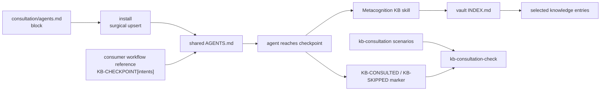

# 0003-structural-kb-consultation — Design

## Architecture

Caption: Metacognition ships one provider-neutral consultation block into the shared operating frame. A consuming workflow opts in by placing a small checkpoint marker at an authoring step; the block expands that marker into KB skill names, JIT consultation, and a reviewable marker. A scenario checker measures whether the checkpoint improved KB consultation without surfacing on nonmatching work.

## D-1: kb-consultation-agents-block

Ship a new framework-owned `consultation/agents.md` source containing a complete `<kb_consultation>...</kb_consultation>` block, and have `install` upsert it into the shared `AGENTS.md` on full install and on `--only kb-consultation`. See rationale at [design-rationale.md#D-1-kb-consultation-agents-block].

- The block is authored as a complete span, like practice-skill activation blocks, rather than derived from a sibling stem. The `consultation/` source is a framework-owned, family-level source; `skills/practice/README.md` is the precedent for that shape.
- The block is provider-neutral text. It names no runtime-only command or hook.
- The installer treats this as a family-level lane: it writes **no `SKILL.md`** (the block is an `AGENTS.md` span only), mutates no vault content, and rides the existing, byte-unchanged `upsert_agents_block()`. Shipping no skill body, it sidesteps the practice lane's shared-or-per-vendor `SKILL.md` layout and its `vendor-divergence` gate entirely — it is that lane's simplest case (`Understanding#Delta-1-practice-lane-evolved-span-only-consultation-holds`).
- This realizes `Spec#C-1-framework-owned-consultation-policy` because the policy source lives in Metacognition, not in each consuming workflow.

## D-2: checkpoint-marker-protocol

Use a literal marker protocol, `KB-CHECKPOINT[<intent>,...]`, as the only consumer-workflow adoption surface. See rationale at [design-rationale.md#D-2-checkpoint-marker-protocol].

- Consumers place the marker at the authoring or curation step, before the decision the KB should influence.
- Consumers declare only intent IDs, not skill names or consultation wording.
- Initial intent registry inside `<kb_consultation>`:
  - `context-curation` -> `context-engineering-knowledge-base`
  - `prompt-authoring` -> `prompt-engineering-knowledge-base`
  - `skill-authoring` -> `skill-design-knowledge-base`
  - `tool-contract` -> `tool-design-knowledge-base`
  - `agent-flow` -> `agent-architectures-knowledge-base`
  - `agent-runtime` -> `agent-runtime-knowledge-base`
  - `eval-observability` -> `evaluation-observability-knowledge-base`
- Unknown intent IDs are reported as `KB-SKIPPED[<intent>]: unknown checkpoint intent`; the agent does not invent a mapping.
- This realizes `Spec#B-1-declared-authoring-checkpoint-surfaces-kb`, `Spec#B-4-consumer-workflow-adopts-policy-by-reference`, and `Spec#B-3-nonmatching-work-stays-quiet`.

## D-3: jit-consultation-and-visible-marker

At a checkpoint, the agent invokes each mapped KB skill, reads that KB's index, selects the fitting entries, and emits one visible marker before or alongside the authoring output: `KB-CONSULTED[<intent> -> <skill>: <slug>,...]`. If the checkpoint is deliberately skipped, it emits `KB-SKIPPED[<intent> -> <skill>]: <reason>`.

- The marker goes in the turn transcript, not inside the authored artifact, unless the consuming workflow explicitly asks for artifact-local provenance.
- A consultation with no fitting entry is recorded as `KB-CONSULTED[<intent> -> <skill>: INDEX-only]`.
- The block instructs the agent to load indexes first and only selected entries, preserving `Spec#C-3-jit-kb-loading`.
- Consistent with the practice lane's "activation triggers; the skill self-grounds" principle (`skills/practice/README.md`), not in tension with it: the `<kb_consultation>` block carries the consultation *policy* — the `D-2` intent→KB registry and this JIT procedure — while the KB siblings it routes to are what self-ground when consulted (`Understanding#Delta-1-practice-lane-evolved-span-only-consultation-holds`).
- This realizes `Spec#B-2-relevant-entry-consulted-before-authoring-decision` and gives `Spec#B-5-passed-over-checkpoint-is-reviewable` a provider-neutral observation.

## D-4: kb-consultation-eval-gate

Add a KB-consultation scenario corpus and `kb-consultation-check` scorer, mirroring the `0001-self-initiated-skill-activation` measurement shape while specializing labels and rates to KB authoring checkpoints. See rationale at [design-rationale.md#D-4-kb-consultation-eval-gate].

- Corpus path: `consultation/scenarios/corpus.jsonl`.
- Scenario schema: `id`, `setup`, `prompt`, `checkpoint_intents`, `expected_skills`, `should_surface`, `framing`, and `reproducible`.
- Positive scenarios include a supported workflow checkpoint and expect `KB-CONSULTED` for every expected skill; `KB-SKIPPED` is scored as reviewable handling, not successful consultation.
- Negative scenarios contain ordinary work or nonmatching workflow moments and expect no KB marker and no KB skill firing.
- The scorer reads a run manifest and transcripts, then emits a miss / skip / false-surface worklist plus `consultation_rate`, `handled_rate`, and `false_surface_rate`.
- Promotion uses the same product-decision shape as `0001`: baseline plus lift margin on `consultation_rate`, bounded `false_surface_rate`, and repeated runs. This realizes `Spec#C-4-evidence-gated-promotion` and keeps `Spec#C-5-kb-authoring-specialization-of-0001` explicit.

## D-5: leanplan-marker-only-first-adopter

LeanPlan adopts the feature by adding only `KB-CHECKPOINT[...]` marker lines at artifact-writing steps; it does not copy the intent registry, skill names, or consultation wording.

- Requirements / Specify / Design / Tasks authoring steps use `context-curation,prompt-authoring`.
- Any LeanPlan step that changes SKILL.md-like instruction bodies or skill behavior uses `skill-authoring` in addition to the prose intents.
- The adopted marker is enough for the installed Metacognition block to supply the behavior, satisfying `Spec#B-4-consumer-workflow-adopts-policy-by-reference`.

## D-6: no-description-reordering-as-fix

Do not change KB skill descriptions as the primary mechanism for this feature.

- Descriptions remain the Level-1 discovery signal for explicit skill matching, but this feature's structural checkpoint comes from `D-1` / `D-2`.
- The `0001` worktree found trigger-first description ordering hurt scoped-skill activation in its measured corpus; that evidence does not directly measure KB siblings, but it is strong enough to avoid another plausibility-only description rewrite.
