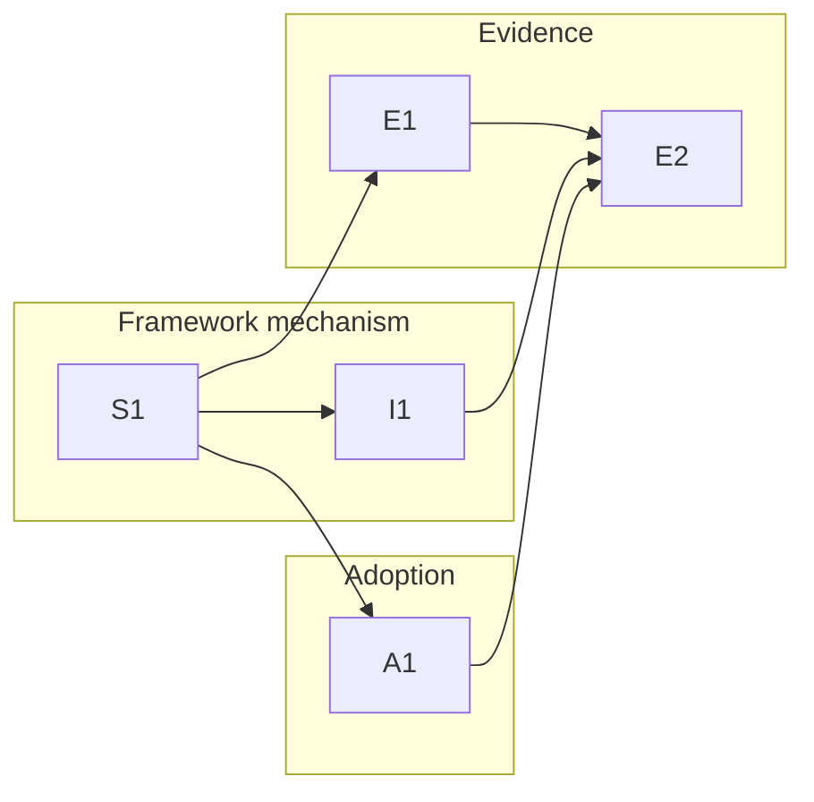

# 0003-structural-kb-consultation — Tasks

## Guidelines

- **Evidence before promotion.** A plausible block wording is a *candidate*, not a fix: the mechanism is not promoted until `E2` shows a `consultation_rate` lift over baseline with `false_surface_rate` within the accepted bound (`Spec#C-4-evidence-gated-promotion`). This is the feature's reason to exist — prior plausible activation changes failed.

## Dependency DAG

<!-- caption: FW ships the consultation block (source → install lane). EV builds the scenario gate, then promotes only on measured lift. AD is the LeanPlan marker-only first adopter. E2 needs the mechanism installed (I1) and a real adopter (A1) to measure. -->

## T: S1

- **Goal**: Author the framework-owned `<kb_consultation>` span as a new `consultation/agents.md` source — the single by-reference adoption surface that turns a declared `KB-CHECKPOINT[<intent>]` into the mapped KB skill names, a JIT consult, and a reviewable marker (`Design#D-1-kb-consultation-agents-block`, `Design#D-2-checkpoint-marker-protocol`, `Design#D-3-jit-consultation-and-visible-marker`). The block *is* the mechanism — provider-neutral prose, not a KB-description rewrite (`Design#D-6-no-description-reordering-as-fix`).
- **Repo**: `consultation/` (new, metacognition)
- **Completion**:
  - (a) `consultation/agents.md` is a complete `<kb_consultation>…</kb_consultation>` span carrying the intent→KB-skill registry (`Design#D-2-checkpoint-marker-protocol`) and the JIT-consult + `KB-CONSULTED` / `KB-SKIPPED` marker protocol (`Design#D-3-jit-consultation-and-visible-marker`): a declared checkpoint surfaces its mapped KB skills (`Spec#B-1-declared-authoring-checkpoint-surfaces-kb`), and a consult-or-skip is emitted as a reviewable marker (`Spec#B-2-relevant-entry-consulted-before-authoring-decision`, `Spec#B-5-passed-over-checkpoint-is-reviewable`).
  - (b) Nothing fires absent a declared checkpoint — no ambient surfacing on ordinary work (`Spec#B-3-nonmatching-work-stays-quiet`); an unknown intent is reported (`KB-SKIPPED[<intent>]: unknown checkpoint intent`), never invented a mapping (`Design#D-2-checkpoint-marker-protocol`).
  - (c) Block text is provider-neutral — names no runtime-only command or hook (`Spec#C-2-provider-neutral-contract`) — and the registry + consultation policy live only here, in the framework (`Spec#C-1-framework-owned-consultation-policy`).
  - (d) The consult instruction is index-first, fitting-entries-only — no whole-vault preload (`Spec#C-3-jit-kb-loading`).
- **Dependencies**: none

## T: I1

- **Goal**: Ship the consultation block on install via a family-level lane in `install`, parallel to the practice lane — upsert the `<kb_consultation>` span into the shared `AGENTS.md` on a full install and on `--only kb-consultation`, riding the byte-unchanged `upsert_agents_block` (`Design#D-1-kb-consultation-agents-block`). Verified by extending `install-selftest`.
- **Repo**: `install`, `install-selftest`
- **Completion** (selftest cases against a sandbox):
  - (a) A full install upserts the `<kb_consultation>` span into `<dest>/AGENTS.md`; `--only kb-consultation` upserts only that span (`Spec#B-1-declared-authoring-checkpoint-surfaces-kb`).
  - (b) A pre-existing same-tag span is replaced in place, a second install changes nothing, and content outside the span stays byte-for-byte identical (`Spec#C-1-framework-owned-consultation-policy`).
  - (c) The lane writes no `SKILL.md` and mutates no vault content — an `AGENTS.md` span only, touching neither the practice lane's shared-or-per-vendor layout nor its divergence gate (`Design#D-1-kb-consultation-agents-block`).
  - (d) The deployed span is provider-neutral and lands in the one shared `AGENTS.md` both runtimes read (`Spec#C-2-provider-neutral-contract`); a surgical `--only <sibling>` leaves the consultation span untouched.
- **Dependencies**: S1 (lands the `consultation/agents.md` source the lane deploys and the selftest exercises)

## T: E1

- **Goal**: Build the KB-consultation eval gate — a labeled scenario corpus (`consultation/scenarios/corpus.jsonl`) plus a `kb-consultation-check` scorer that reads a run manifest + transcripts and emits a miss / skip / false-surface worklist with `consultation_rate`, `handled_rate`, `false_surface_rate` (`Design#D-4-kb-consultation-eval-gate`), specializing 0001's measurement shape to KB authoring checkpoints (`Spec#C-5-kb-authoring-specialization-of-0001`).
- **Repo**: `consultation/scenarios/` + scorer (metacognition)
- **Completion**:
  - (a) The corpus carries positive scenarios (a declared checkpoint; expect `KB-CONSULTED` for every expected skill) and negative scenarios (ordinary / nonmatching work; expect no KB marker and no KB skill firing), each on the `Design#D-4-kb-consultation-eval-gate` scenario schema and specialized to KB authoring checkpoints (`Spec#C-5-kb-authoring-specialization-of-0001`).
  - (b) The scorer emits the three rates plus the miss/skip/false-surface worklist from a manifest + transcripts, making a passed-over checkpoint reviewable (`Spec#B-5-passed-over-checkpoint-is-reviewable`).
  - (c) `KB-SKIPPED` is scored as reviewable handling (`handled_rate`), not as successful consultation (`Design#D-4-kb-consultation-eval-gate`).
- **Dependencies**: S1 (the `KB-CONSULTED` / `KB-SKIPPED` marker format the scorer parses) — enabler; the corpus can be authored in parallel

## T: A1

- **Goal**: Adopt the feature in LeanPlan marker-only — add `KB-CHECKPOINT[…]` lines at LeanPlan's Requirements / Specify / Design / Tasks authoring steps (and `skill-authoring` on any step that edits SKILL.md-like instruction bodies), declaring only intent IDs while the installed Metacognition block supplies the behavior (`Design#D-5-leanplan-marker-only-first-adopter`, `Spec#B-4-consumer-workflow-adopts-policy-by-reference`).
- **Repo**: LeanPlan source (cross-repo — the `~/.local/share/leanplan` external, not metacognition)
- **Completion**:
  - (a) The named LeanPlan authoring steps carry `KB-CHECKPOINT` marker lines with the intents per `Design#D-5-leanplan-marker-only-first-adopter`.
  - (b) No LeanPlan doc copies or restates the intent→KB registry, skill names, or consultation wording — adoption is by-reference (`Spec#B-4-consumer-workflow-adopts-policy-by-reference`, `Spec#C-1-framework-owned-consultation-policy`).
  - (c) Every marker uses only an intent ID the framework registry defines (`Design#D-2-checkpoint-marker-protocol`).
- **Dependencies**: S1 (the registry intents the markers reference) — enabler
- **Guidelines**: Cross-repo — the edits land in the LeanPlan source repo; verify against an installed build so the Metacognition block actually resolves the markers.

## T: E2

- **Goal**: Promote the mechanism only on evidence — run the eval gate at baseline (block absent) vs installed (block present, exercised by a real adopter checkpoint), repeated, and promote only on a `consultation_rate` lift over baseline with `false_surface_rate` within the accepted bound (`Spec#C-4-evidence-gated-promotion`, `Design#D-4-kb-consultation-eval-gate`). Record the verdict.
- **Repo**: metacognition (measurement run + verdict record)
- **Completion**:
  - (a) `consultation_rate` is recorded at baseline and post-install over repeated runs; promotion is asserted only on a lift (`Spec#C-4-evidence-gated-promotion`).
  - (b) `false_surface_rate` stays within the stated bound across those runs — confirming nonmatching work stays quiet under the real mechanism (`Spec#B-3-nonmatching-work-stays-quiet`, `Spec#C-4-evidence-gated-promotion`).
  - (c) A verdict record states promote-or-iterate with the baseline, lift, bound, and run count.
- **Dependencies**: E1 (the harness + rates), I1 (the installed mechanism to measure), A1 (a real adopter checkpoint to exercise) — enablers
