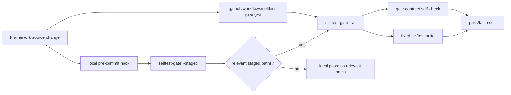

# 0004-gate-selftest-on-change — Design

## Architecture

The gate is a source-controlled runner invoked by two surfaces: the authoritative CI workflow and an opt-in local hook. CI always produces the review signal; the local hook is a maintainer convenience that can fail earlier.

## D-1: selftest-gate-runner

Add a root executable `selftest-gate` as the single gate runner for `Spec#B-1-guarded-change-produces-selftest-result`, `Spec#B-2-failing-selftest-blocks-healthy-signal`, `Spec#C-2-current-pass-required-for-health`, `Spec#C-4-enforcement-is-verdict-only`, and `Spec#C-5-review-signal-is-clean-checkout-reproducible`. See rationale at [design-rationale.md#D-1-selftest-gate-runner].

- CLI:
  - `./selftest-gate --all` runs the gate contract check and the full fixed selftest suite.
  - `./selftest-gate --staged` reads staged paths with `git diff --cached --name-only --diff-filter=ACMRD`, skips with exit 0 when none are relevant, and otherwise runs the same gate as `--all` (`Understanding#Delta-1-staged-deletes-remain-relevant`).
  - `./selftest-gate --install-pre-commit` installs or refreshes the local hook described in `Design#D-3-local-pre-commit-hook`.
- Suite command list, in this order: `./scripts/install-selftest`, `./scripts/generate-selftest`, `./scripts/maintenance-selftest`, `./scripts/health-check-selftest`, `./scripts/no-net-loss-selftest`, `./engine/selftest`.
- Output prints one `RUN`, `PASS`, or `FAIL` line per contract check and suite command, then a final `selftest-gate: PASS` or `selftest-gate: FAIL`.
- Exit code is zero only when every executed check passed. Missing commands, nonzero exits, timeouts, and interrupted subprocesses are failures.
- The runner never calls `scripts/install-selftest --update-divergence` and never rewrites repository source.

## D-2: github-actions-authoritative-gate

Add `.github/workflows/selftest-gate.yml` as the authoritative review-path gate for `Spec#B-1-guarded-change-produces-selftest-result`, `Spec#B-2-failing-selftest-blocks-healthy-signal`, `Spec#C-1-relevant-source-coverage`, `Spec#C-2-current-pass-required-for-health`, `Spec#C-3-framework-homes-have-equivalent-enforcement`, and `Spec#C-5-review-signal-is-clean-checkout-reproducible`. See rationale at [design-rationale.md#D-2-github-actions-authoritative-gate].

- Workflow identity: `name: selftest-gate`, one job named `selftest-gate`.
- Events: `pull_request`, `push` for all branches, and `workflow_dispatch`.
- No `paths` or `paths-ignore` filters appear in the workflow; every workflow run produces a fresh verdict for the checked source state.
- Job shape: `permissions: contents: read`, hosted Ubuntu runner, checkout step using `actions/checkout@v7`, then `./selftest-gate --all`.
- The same committed workflow and runner files are used in both framework homes; no repository-specific paths, secrets, vaults, or account names are embedded.

## D-3: local-pre-commit-hook

`selftest-gate --install-pre-commit` installs an opt-in local pre-commit hook that invokes `./selftest-gate --staged`, satisfying `Spec#B-3-local-guard-can-be-enabled` without making local hooks authoritative for `Spec#C-2-current-pass-required-for-health`. The main `install` command surfaces this as optional setup with explicit `--install-pre-commit` / `--no-install-pre-commit` flags and skips hook setup by default in non-interactive runs (`UnderstandingShifts#Delta-3-install-surfaces-local-guard`). See rationale at [design-rationale.md#D-3-local-pre-commit-hook].

- Hook path is resolved with `git rev-parse --git-path hooks/pre-commit`, so normal checkouts and linked worktrees use the correct Git hook location.
- Created hook wrapper:
  - resolves `repo_root` with `git rev-parse --show-toplevel`;
  - runs `"$repo_root/selftest-gate" --staged` and stops the hook only when the gate fails;
  - contains a `metacognition selftest-gate` sentinel block.
- When an unmanaged non-empty hook already exists, the installer preserves it as a sidecar hook and invokes it after the gate passes.
- Re-running the installer replaces only an existing sentinel-managed hook.
- A non-empty hook without the sentinel is not deleted or overwritten; the installer adds the managed wrapper while preserving the existing hook behavior (`UnderstandingShifts#Delta-2-local-hook-install-is-additive`).
- Local bypass remains Git's explicit `--no-verify` path; CI still runs `Design#D-2-github-actions-authoritative-gate`.

## D-4: source-relevance-classifier

The local `--staged` path uses a hard-coded source relevance classifier for `Spec#C-1-relevant-source-coverage`; CI does not depend on this classifier because `Design#D-2-github-actions-authoritative-gate` runs the full gate.

- Relevant exact paths: `.github/workflows/selftest-gate.yml`, `selftest-gate`, `install`, `scripts/install-selftest`, `scripts/generate`, `scripts/generate-selftest`, `scripts/maintenance-selftest`, `scripts/health-check`, `scripts/health-check-selftest`, `scripts/no-net-loss`, `scripts/no-net-loss-selftest`, `FAMILY.md`, `SOURCES.md`.
- Relevant prefixes: `engine/`, `config/`, `templates/`, `wiring/`, `skills/`.
- Deleted relevant paths are relevant; rename and modification records are treated by their reported path names.

## D-5: gate-contract-selfcheck

`selftest-gate --all` begins with a source-level contract check that reports gate setup drift before running the suite, satisfying `Spec#C-3-framework-homes-have-equivalent-enforcement` and `Spec#C-4-enforcement-is-verdict-only`. See rationale at [design-rationale.md#D-5-gate-contract-selfcheck].

- The check reads `.github/workflows/selftest-gate.yml` and fails if it lacks `name: selftest-gate`, `pull_request`, `push`, `actions/checkout@v7`, or `./selftest-gate --all`.
- The check fails if the workflow contains `paths:` or `paths-ignore:`.
- The check fails if `selftest-gate` is not executable.
- The check emits verdict text only; it does not repair the workflow or file modes.
