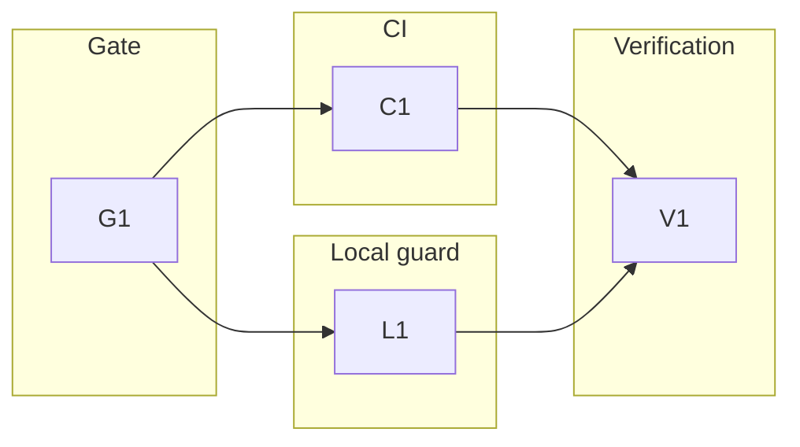

# 0004-gate-selftest-on-change — Tasks

## Dependency DAG

Tracks separate the shared executable gate, the two enforcement surfaces, and the final verification pass. Edges show which work produces the artifacts another task exercises.

## T: G1

- **Goal**: Land the shared executable gate so both enforcement surfaces invoke one maintained verdict path (`Design#D-1-selftest-gate-runner`, `Design#D-4-source-relevance-classifier`, `Design#D-5-gate-contract-selfcheck`).
- **Repo**: `metacognition`
- **Completion**:
  - A clean local run of `./selftest-gate --all` produces a pass/fail result for the current source state (`Spec#B-1-guarded-change-produces-selftest-result`, `Spec#C-2-current-pass-required-for-health`).
  - A deliberately failing suite command in a throwaway copy produces a nonzero result with enough command output to identify the failed check (`Spec#B-2-failing-selftest-blocks-healthy-signal`).
  - Staged-path cases prove relevant paths run the gate and irrelevant paths skip locally (`Spec#C-1-relevant-source-coverage`).
  - A source diff after a passing gate run is empty except for intentional implementation files (`Spec#C-4-enforcement-is-verdict-only`, `Spec#C-5-review-signal-is-clean-checkout-reproducible`).
- **Dependencies**: none

## T: C1

- **Goal**: Add the authoritative review-path enforcement surface around the shared gate (`Design#D-2-github-actions-authoritative-gate`).
- **Repo**: `metacognition`
- **Completion**:
  - The workflow file validates through `./selftest-gate --all` contract checks (`Spec#B-1-guarded-change-produces-selftest-result`, `Spec#C-2-current-pass-required-for-health`).
  - The workflow contains no path filters and names no repository-specific secrets, vaults, or accounts (`Spec#C-1-relevant-source-coverage`, `Spec#C-3-framework-homes-have-equivalent-enforcement`, `Spec#C-5-review-signal-is-clean-checkout-reproducible`).
  - Removing or weakening the workflow in a throwaway copy makes the gate fail before the suite verdict is reported (`Spec#B-2-failing-selftest-blocks-healthy-signal`).
- **Dependencies**: G1

## T: L1

- **Goal**: Add the opt-in local guard installer on the shared gate path (`Design#D-3-local-pre-commit-hook`, `Design#D-1-selftest-gate-runner`).
- **Repo**: `metacognition`
- **Completion**:
  - Installing the hook in a sandboxed repository makes relevant staged changes invoke the gate before local handoff (`Spec#B-3-local-guard-can-be-enabled`).
  - Re-running the installer is idempotent for a sentinel-managed hook, while an unrelated hook is preserved and has the gate behavior added (`Spec#B-3-local-guard-can-be-enabled`).
  - A local bypass does not create or modify the authoritative review-path result (`Spec#C-2-current-pass-required-for-health`).
- **Dependencies**: G1

## T: V1

- **Goal**: Reconcile the finished feature against the Spec and Design before implementation close-out (`Spec#B-1-guarded-change-produces-selftest-result`, `Spec#B-2-failing-selftest-blocks-healthy-signal`, `Spec#B-3-local-guard-can-be-enabled`, `Spec#C-1-relevant-source-coverage`, `Spec#C-2-current-pass-required-for-health`, `Spec#C-3-framework-homes-have-equivalent-enforcement`, `Spec#C-4-enforcement-is-verdict-only`, `Spec#C-5-review-signal-is-clean-checkout-reproducible`).
- **Repo**: `metacognition`
- **Completion**:
  - Run LeanPlan validation through Tasks and close-out reconciliation over every load-bearing citation in this artifact.
  - Run the full gate locally from a clean checkout and confirm a clean Git diff afterward (`Spec#C-4-enforcement-is-verdict-only`, `Spec#C-5-review-signal-is-clean-checkout-reproducible`).
  - Confirm the implementation PR/check output exposes the authoritative gate verdict for the branch source state (`Spec#B-1-guarded-change-produces-selftest-result`, `Spec#C-2-current-pass-required-for-health`).
- **Dependencies**: C1, L1
