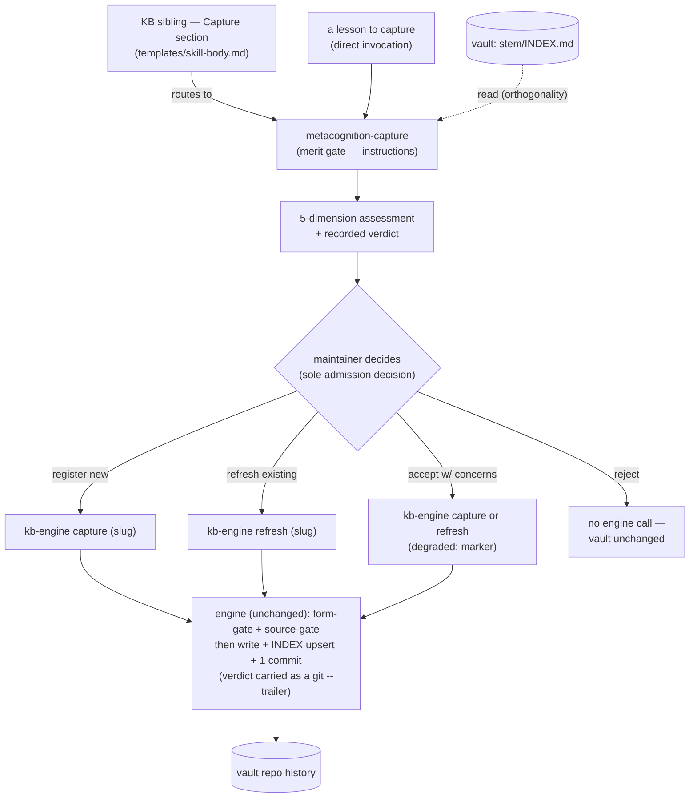

# 0005-kb-capture-merit-gate — Design

## Architecture

The merit gate is a dedicated, hand-authored front-door skill (`metacognition-capture`) that runs the merit assessment as provider-neutral instructions, surfaces a verdict, and routes the maintainer's decision to the unchanged engine. The engine stays the sole writer; the vault `INDEX.md` is a read-only reference for the orthogonality check. KB siblings reach capture by routing through the gate instead of calling the engine directly.

Boundary: everything above the engine box is the gate (assessment + maintainer decision); the engine box and the vault below it are unchanged. The gate never writes the vault — it only decides whether and how to invoke the engine.

## D-1: dedicated-capture-front-door-skill
A new hand-authored multi-file skill `skills/metacognition-capture/` (SKILL.md + `references/`), deployed byte-identical to both providers by a new installer `deploy_capture` lane modeled on `deploy_maintenance` (`install:236`). It is the family's admission front door, beside `metacognition-maintenance` (curation of admitted entries) and `metacognition-freshness` (install currency).
- Chosen over inlining the checklist into the shared KB body and over an engine hook — see rationale at [design-rationale.md#D-1-dedicated-capture-front-door-skill].
- Token model mirrors maintenance: SKILL.md uses `@ENGINE_BIN@` + `@CONFIG_DIR@` placeholders (plus the vault/INDEX root) baked at install (`install:219-233`), so the gate composes a per-topic `--config @CONFIG_DIR@/<stem>` at runtime rather than binding one sibling.
- Activation description triggers on capturing / registering a durable lesson into the vault (exact wording is authoring-time).

## D-2: gate-runs-as-instructions-engine-unchanged
The merit assessment is provider-neutral prose instructions (LLM judgment) — not code and not an engine change; accepted entries flow through the unchanged `@ENGINE@ capture|refresh <slug>` stdin CLI (the single seam, `templates/skill-body.md:29-31,61`). No wrapper or helper binary is added. Satisfies `Spec#C-2-writes-only-through-the-engine`; the assessment running before that call realizes `Spec#B-1-assessment-precedes-write`.
- Chosen over a thin read-only helper script and over the engine hook — see rationale at [design-rationale.md#D-2-gate-runs-as-instructions-engine-unchanged].

## D-3: kb-capture-section-routes-through-gate
The engine `capture`/`refresh` invocation moves out of the shared `templates/skill-body.md` Capture/Refresh sections (`:22-64`) and into the gate skill; the KB section becomes a thin pointer instructing the agent to route a lesson through `metacognition-capture`, which performs the assessment and then makes the engine call. Realizes `Spec#C-1-every-create-or-update-is-gated` — with the direct call removed, no sibling create/update reaches the engine without the gate — and `Spec#B-4-decision-routes-to-engine-operation`, since the gate (not the sibling) now makes the per-decision engine call.
- One-line why: a front door only gates everything if the existing doors route to it; trivial given D-1, no live alternative.
- Note: editing the shared body re-renders every KB-sibling adapter in both providers on the next `./install` (the single-source blast radius, `install:75-117`); the per-sibling `@ENGINE@`/`@CONFIG@` token bakes move to the gate's `@ENGINE_BIN@`/`@CONFIG_DIR@` (D-1).

## D-4: verdict-recorded-as-engine-git-trailer
The gate records its merit verdict by passing it to the engine as a git trailer (`kb-engine ... --trailer <KEY>:<verdict>`, `kb-engine:440-444`), so the verdict lands in the vault commit alongside the entry — the same provenance mechanism maintenance uses for its `Heal-*` trailers.
- Chosen over recording in the entry body or a separate log — see rationale at [design-rationale.md#D-4-verdict-recorded-as-engine-git-trailer].
- Realizes the recorded-verdict half of `Spec#C-3-gate-records-but-never-blocks` and the success signal (every admitted entry carries a maintainer-reviewed verdict).

## D-5: per-claim-authority-layers-above-engine-host-check
The authority dimension (`Spec#B-3-authority-mapped-per-claim`) is the judgment layer above the engine's deterministic host-allowlist gate, not a replacement: the engine's `sources.authority_violation` host check still runs underneath (`engine/sources.py:119-130`), while the gate adds the per-claim source→claim mapping the engine explicitly defers to "the skill's envelope" (`engine/kb-engine:369-371`).
- One-line why: the engine host check is sole-support-below-bar and per-entry, so the `concise-not-compressed` headline passes it; the per-claim judgment must live above the deterministic engine, which is exactly the gap.

## D-6: accept-with-concerns-routes-through-degraded-marker
When the maintainer accepts an entry despite unresolved authority/merit concerns, the gate offers writing it through the engine's existing `degraded:` frontmatter marker (`kb-engine:294-297,374-386`) — admitted-but-flagged (down-ranked `⚠` in the INDEX), a visible trace rather than a silent full-merit accept.
- One-line why: reuses the engine's quarantine-exemption affordance instead of inventing a new "admitted with concerns" state; a maintainer option, not forced — `Spec#C-3-gate-records-but-never-blocks` keeps the maintainer the sole decider.

## D-7: gate-resolves-target-sibling-from-context
The gate is topic-parameterized like the engine: routed from a sibling it inherits that sibling's stem (reads `<vault>/<stem>/INDEX.md` for the orthogonality comparison that backs `Spec#B-2-orthogonality-classifies-new-refresh-reject`, calls `--config @CONFIG_DIR@/<stem>`); invoked standalone it requires the maintainer to name the target topic.
- One-line why: orthogonality is checked against the target topic's INDEX and the engine call needs that topic's config, so the gate cannot be topic-agnostic; trivial, mirrors maintenance's per-stem operation.
