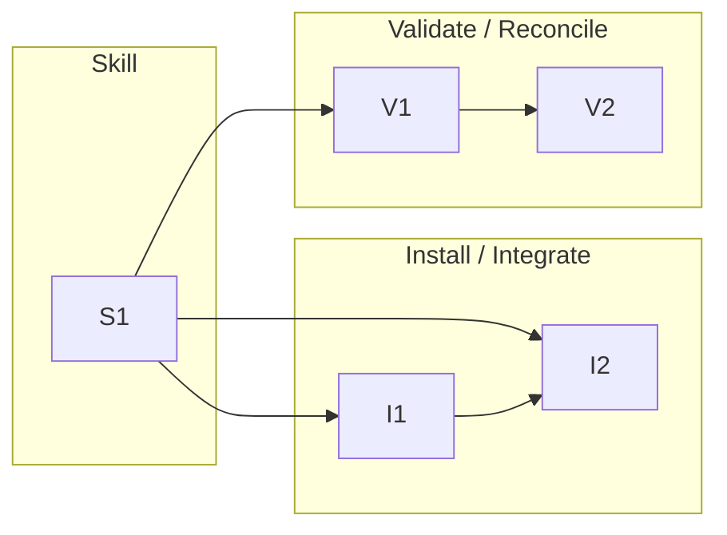

# 0005-kb-capture-merit-gate — Tasks

## Guidelines
- **Two repos.** Skill, installer, and template work lands in `metacognition` (this round's branch); the test-case reconciliation lands in `metacognition-vault`. The engine stays the sole vault writer — route every vault mutation through `kb-engine`, never hand-edit an entry or INDEX.
- **Dual-adapter parity.** Every change ships byte-identical to Claude and Codex through the installer; `install-selftest` parity must pass before close-out.
- **Self-applying acceptance.** The gate must catch `concise-not-compressed` (orthogonality overlap + headline authority). That entry is local-only (vault commit `a0de939`) and must be reconciled, never pushed as-is.

## Dependency DAG

Tracks: **S** authors the gate skill, **I** ships it and routes capture through it, **V** proves it on the live failure and cleans up that entry.

## T: S1

- **Goal**: Author the `metacognition-capture` gate skill — the merit assessment, the maintainer decision, and the engine invocation — as provider-neutral instructions (`Design#D-1-dedicated-capture-front-door-skill`, `Design#D-2-gate-runs-as-instructions-engine-unchanged`), so a capture is assessed before any write (`Spec#B-1-assessment-precedes-write`), classified for orthogonality against the target INDEX (`Spec#B-2-orthogonality-classifies-new-refresh-reject`, `Design#D-7-gate-resolves-target-sibling-from-context`), authority-mapped per claim above the engine host-check (`Spec#B-3-authority-mapped-per-claim`, `Design#D-5-per-claim-authority-layers-above-engine-host-check`), decided by the maintainer who is never auto-overruled (`Spec#C-3-gate-records-but-never-blocks`), and written only through the unchanged engine (`Spec#C-2-writes-only-through-the-engine`) carrying the verdict as a trailer (`Design#D-4-verdict-recorded-as-engine-git-trailer`) with accept-with-concerns via the degraded marker (`Design#D-6-accept-with-concerns-routes-through-degraded-marker`). Structure as `SKILL.md` + `references/` for progressive disclosure, mirroring `metacognition-maintenance`.
- **Repo**: `metacognition` (`skills/metacognition-capture/`)
- **Completion**:
  - (a) following the skill on a sample lesson surfaces the five-dimension assessment before any `kb-engine` call (`Spec#B-1-assessment-precedes-write`);
  - (b) an overlapping candidate is classified refresh-of-named-entry and a novel one new (`Spec#B-2-orthogonality-classifies-new-refresh-reject`);
  - (c) each major claim maps to a source or "synthesized", and a headline backed only by a supporting-point citation is flagged (`Spec#B-3-authority-mapped-per-claim`);
  - (d) the maintainer's register / refresh / reject / accept-with-concerns decision drives the outcome and the gate never auto-rejects (`Spec#C-3-gate-records-but-never-blocks`);
  - (e) accepted entries are written only via `kb-engine capture|refresh` with the verdict as a `--trailer`, accept-with-concerns via `degraded:`, and the gate issues no direct vault write (`Spec#C-2-writes-only-through-the-engine`).
- **Dependencies**: none

## T: I1

- **Goal**: Add the `deploy_capture` installer lane so the gate ships byte-identical to both providers (`Design#D-1-dedicated-capture-front-door-skill`) — mirror the existing `deploy_maintenance` lane, including its token-baking and orphan-pruning.
- **Repo**: `metacognition` (`install`, `install-selftest`)
- **Completion**:
  - `./install --only metacognition-capture` deploys `SKILL.md` + `references/` byte-identical to `~/.claude/skills/metacognition-capture/` and `~/.codex/skills/metacognition-capture/` with tokens resolved to absolute paths;
  - `install-selftest` passes for the new lane (Claude/Codex parity).
- **Dependencies**: S1 (the skill must exist to deploy).

## T: I2

- **Goal**: Route the KB capture/refresh path through the gate (`Spec#C-1-every-create-or-update-is-gated`, `Spec#B-4-decision-routes-to-engine-operation`) by editing the shared `templates/skill-body.md` Capture/Refresh sections so the engine call moves into the gate and the sibling section becomes a thin pointer (`Design#D-3-kb-capture-section-routes-through-gate`), then re-render all siblings.
- **Repo**: `metacognition` (`templates/skill-body.md`, re-render via `./install`)
- **Completion**:
  - after re-render, no KB-sibling adapter invokes `kb-engine capture|refresh` directly (grep the rendered `~/.claude` + `~/.codex` adapters) — capturing within any sibling routes through `metacognition-capture` (`Spec#C-1-every-create-or-update-is-gated`);
  - the per-decision engine call is issued by the gate, not the sibling (`Spec#B-4-decision-routes-to-engine-operation`).
- **Dependencies**: S1 (routing target exists), I1 (gate deployed so the reference resolves).

## T: V1

- **Goal**: Prove the gate on the live failure — run it against `concise-not-compressed` and confirm it raises the orthogonality overlap and the headline-authority flag the form-gate let through (`Spec#B-2-orthogonality-classifies-new-refresh-reject`, `Spec#B-3-authority-mapped-per-claim`; the self-applying acceptance Guideline).
- **Repo**: `metacognition` (reads `metacognition-vault`)
- **Completion**:
  - a documented gate run on the entry yields (a) orthogonality overlap with `literal-vs-latent-matching` → verdict refresh-not-new (`Spec#B-2-orthogonality-classifies-new-refresh-reject`); (b) a headline-authority flag — synthesized claim, sub-claim-only citation (`Spec#B-3-authority-mapped-per-claim`).
- **Dependencies**: S1.

## T: V2

- **Goal**: Reconcile the `concise-not-compressed` test-case entry per the gate's verdict — fold it into `literal-vs-latent-matching` as a refresh (or re-source if genuinely kept), never push as-is (the self-applying acceptance Guideline; the orthogonality outcome of `Spec#B-2-orthogonality-classifies-new-refresh-reject`).
- **Repo**: `metacognition-vault`
- **Completion**:
  - the vault no longer carries `concise-not-compressed` as a standalone un-orthogonal entry — it is refreshed into `literal-vs-latent-matching` (or re-sourced), written via `kb-engine` (engine = sole writer);
  - nothing is pushed as-is; the local-only commit `a0de939` is superseded/reconciled, not pushed.
- **Dependencies**: V1 (the gate's verdict informs the reconciliation).
