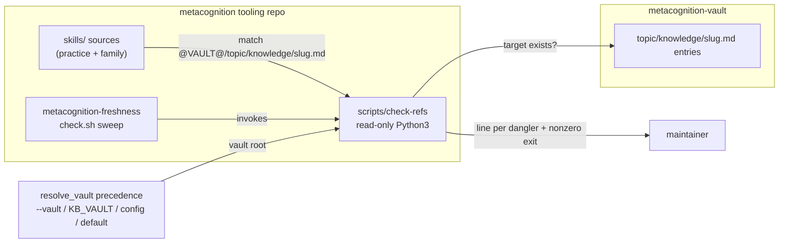

# 0006-vault-reference-integrity — Design

## Architecture

A standalone read-only script in `scripts/`, peer to `health-check` and `no-net-loss`, scans the framework's skill sources for baked-entry references, resolves each against the configured vault, and reports any whose target entry does not exist. `metacognition-freshness` folds it into its sweep so a single freshness run includes reference integrity.

Caption: `check-refs` reads skill sources (never writes), resolves `@VAULT@` via the shared precedence, and asserts each `<topic>/knowledge/<slug>.md` target exists in the vault; `metacognition-freshness` surfaces the result in its verdict.

## D-1: check-refs-script

A new standalone read-only check script `scripts/check-refs` (Python3), peer to `health-check` / `no-net-loss` and following their conventions. Realizes `Spec#B-1-dangling-reference-reported`, `Spec#B-2-intact-references-pass-clean`, `Spec#C-3-read-only-on-demand`.

- **Vault resolution** — same precedence as the engine: `--vault` arg › `$<PREFIX>_KB_VAULT` › `$KB_VAULT` › `$XDG_CONFIG_HOME/metacognition/vault` › default `~/.local/share/metacognition-vault`. Reuse `kb-engine`'s `resolve_vault` if import-safe, else the ~10-line mirror `health-check` already uses (`scripts/health-check:56-69`).
- **Output** — stdout: one line per dangling reference, `<consumer-source-path>: <topic>/knowledge/<slug>.md` (the offending consumer + its unresolved target). stderr summary: `scanned N references across M surfaces, K dangling`. No writes anywhere (`Spec#C-3`).
- **Exit code** — `0` when `K == 0` (`Spec#B-2`); nonzero when `K > 0` (`Spec#B-1` failure signal). This follows `no-net-loss`'s gate convention, not `health-check`'s always-`0`, because the maintainer needs a pass/fail signal.
- **On-demand only** — invoked explicitly; no scheduler (`Spec#C-3`).

## D-2: scan-skill-sources-for-baked-refs

The check discovers references by scanning the framework's skill SOURCE files under `skills/` for the pattern `@VAULT@/<topic>/knowledge/<slug>.md`, resolves `@VAULT@` to the configured vault, and treats a reference as resolved iff the target file exists. Realizes `Spec#C-1-coverage-framework-surfaces`, `Spec#B-1-dangling-reference-reported`, `Spec#B-2-intact-references-pass-clean`. See rationale at [design-rationale.md#D-2-scan-skill-sources-for-baked-refs].

- **Scan root** — `skills/`, covering `skills/practice/*/{claude,codex}/SKILL.md` and `skills/metacognition-*/**`. Complete by construction: a new consumer added under `skills/` is covered with no registration step (`Spec#C-1`), reusing the filesystem-discovery model of `practice_skills()` (`install:310-319`).
- **Match pattern** — `@VAULT@/<topic>/knowledge/<slug>.md`, where `<slug>` is `[a-z0-9][a-z0-9-]*` (the engine's entry-slug charset). Generic `@VAULT@`-root references (no `/knowledge/<slug>.md` tail) are not matched — only specific-entry pointers.
- **Resolution** — for each match, `<vault>/<topic>/knowledge/<slug>.md` must be an existing regular file.
- **Source, not deployed** — scanning pre-bake sources is equivalent to scanning the deployed skills: `install` renders the deployed copy byte-identical (orphan-pruned, fail-on-unbaked-token), and the `/<topic>/knowledge/<slug>.md` tail is identical pre/post bake. Scanning sources is therefore repo-local and CI-able.
- **Logged scope edge** — KB-sibling adapters (rendered from `wiring/`+`templates/`+`config/`) carry only generic vault references today, so they sit outside the scan; the summary names the roots scanned, making this a visible extension point rather than a silent gap.

## D-3: surface-via-freshness

`metacognition-freshness` folds `check-refs` into its `check.sh` sweep, marking `**` when danglers are found, so the maintainer's single freshness run covers reference integrity. Realizes the Requirements "run one check" outcome. WHY: freshness is the framework's "is my install valid" skill — it already checks adapter parity, and consumer→vault reference integrity is the same validity axis. `check.sh` invokes `@FAMILY_REPO@/scripts/check-refs --vault @VAULT@` and folds its exit/output into the verdict.

## D-4: document-contract-in-architecture

The consumer→vault soft-reference contract is documented as a new load-bearing rule in `ARCHITECTURE.md` § "Load-bearing rules" (`ARCHITECTURE.md:47-53`): a consumer fuses an inline floor (a self-contained runnable procedure that survives its referenced entry being renamed, retired, or re-homed) + a local procedure + an optional soft pointer to ONE vault entry for depth — and that pointer is externally checked (`check-refs`), never a hard import. Realizes the "documented contract" outcome and the intent behind `Spec#C-2-soft-reference-integrity` (whose runtime facet — the check being external and read-only, never breaking a consumer — is realized by `D-1`). WHY: that section already holds the load-bearing invariants and sits beside the two-repo rationale, which is exactly "where the two-repo rationale lives" (Requirements success signal).
