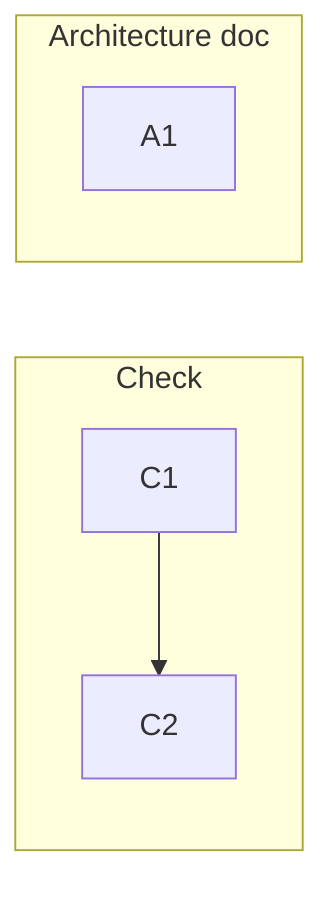

# 0006-vault-reference-integrity — Tasks

## DAG

Two independent tracks: **C** builds the reference-integrity check and surfaces it through freshness; **A** documents the contract the check enforces. All work lands in the `metacognition` tooling repo; the vault is read-only.

## T: C1

- **Goal**: Deliver the read-only reference-integrity check `scripts/check-refs` that reports dangling consumer→vault pointers (`Spec#B-1-dangling-reference-reported`) and passes clean when every reference resolves (`Spec#B-2-intact-references-pass-clean`), built per `Design#D-1-check-refs-script` and `Design#D-2-scan-skill-sources-for-baked-refs`. Coverage is complete-by-construction over `skills/` (`Spec#C-1-coverage-framework-surfaces`); the run is read-only and on-demand (`Spec#C-3-read-only-on-demand`, `Spec#C-2-soft-reference-integrity` runtime facet — the check is the sole asserter and never mutates a consumer).
- **Repo**: `metacognition` (`scripts/check-refs`)
- **Completion**:
  - (a) a skill source referencing a non-existent entry → that consumer and its unresolved target are printed and the run exits nonzero (`Spec#B-1-dangling-reference-reported`).
  - (b) all references resolve → zero danglers reported, exit 0 (`Spec#B-2-intact-references-pass-clean`).
  - (c) a newly added `skills/practice/<x>/.../SKILL.md` carrying a reference is covered with no registration step (`Spec#C-1-coverage-framework-surfaces`).
  - (d) a run writes nothing to any repo (working tree and history unchanged) and takes no scheduled/automatic action (`Spec#C-3-read-only-on-demand`, `Spec#C-2-soft-reference-integrity`).
- **Dependencies**: none

## T: C2

- **Goal**: Surface `check-refs` in the `metacognition-freshness` sweep so a single freshness run includes reference integrity and flags an action when danglers exist (`Design#D-3-surface-via-freshness`), realizing the "run one check" outcome.
- **Repo**: `metacognition` (`skills/metacognition-freshness/scripts/check.sh`)
- **Completion**:
  - (a) against a vault with a dangling reference, the freshness check flags an action (`**`) and reports the dangler (`Spec#B-1-dangling-reference-reported`).
  - (b) against an intact vault, the sweep stays clean (`Spec#B-2-intact-references-pass-clean`).
  - (c) the deployed `check.sh` invokes the baked `@FAMILY_REPO@/scripts/check-refs --vault @VAULT@` and folds its exit/output into the verdict (tokens resolve post-bake).
- **Dependencies**: C1 — lands the `check-refs` script this task wires in.

## T: A1

- **Goal**: Document the consumer→vault soft-reference contract as a load-bearing rule in `ARCHITECTURE.md` §"Load-bearing rules", naming the layered design (inline floor that survives its referenced entry being renamed/retired/re-homed + local procedure + an optional soft pointer to one entry) and that the pointer is externally checked, never a hard import, per `Design#D-4-document-contract-in-architecture`. Records the intent of `Spec#C-2-soft-reference-integrity` in prose.
- **Repo**: `metacognition` (`ARCHITECTURE.md`)
- **Completion**:
  - (a) §"Load-bearing rules" carries the contract rule, sited beside the two-repo rationale (Requirements success signal — "where the two-repo rationale lives").
  - (b) the rule states the soft-reference invariant (`Spec#C-2-soft-reference-integrity`) and names `check-refs` as its guard.
- **Dependencies**: none
